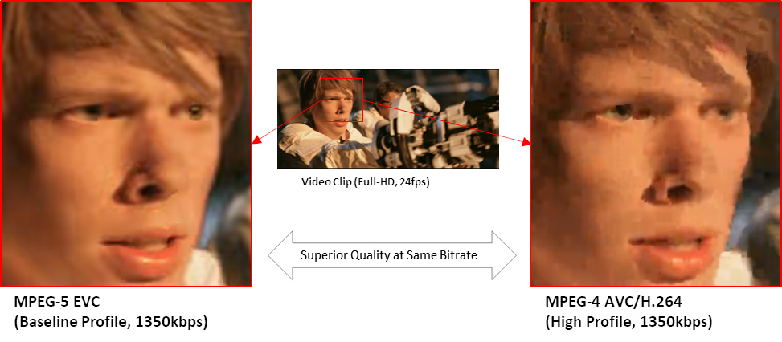

# eXtra-fast Essential Video Encoder (XEVE)  
[](https://github.com/mpeg5/xeve/actions/workflows/build.yml)  

The **eXtra-fast Essential Video Encoder** (XEVE) is an opensource and fast MPEG-5 EVC encoder. 

**MPEG-5 Essential Video Coding** (EVC) is a video compression standard of ISO/IEC Moving Picture Experts Grop (MPEG). The main goal of the EVC is to provide a significantly improved compression capability over existing video coding standards with timely publication of terms. 
The EVC defines two profiles, including "**Baseline Profile**" and "**Main Profile**". The "Baseline profile" contains only technologies that are older than 20 years or otherwise freely available for use in the standard. In addition, the "Main profile" adds a small number of additional tools, each of which can be either cleanly disabled or switched to the corresponding baseline tool on an individual basis.

## Quality comparison

### MPEG-5 Baseline Profile vs. MPEG-4 AVC/H.264
MPEG-5 EVC Baseline Profile can show 2-times better coding gain over MPEG-4 AVC/H.264 codec and superior quality on the same bitrate




### MPEG-5 Main Profile vs. HEVC/H.265
MPEG-5 EVC Main Profile can show 2-times better coding gain over HEVC/H.265 codec and superior quality on the same bitrate


## How to build

### Linux (64-bit)
- Build Requirements
  - CMake 3.12 or later (download from [https://cmake.org/](https://cmake.org/))
  - GCC 5.4.0 or later
  
- Build Instructions for **Baseline Profile**
  ```
  $mkdir build
  $cd build
  $cmake .. -DSET_PROF=BASE
  $make
  $sudo make install
  ```
  - Output Location
    - Executable application (xeveb_app) can be found under build/bin/.
    - Library files (libxeveb.so and libxexeb.a) can be found under build/lib/.

- Build Instructions for **Main Profile**
  ```
  $mkdir build
  $cd build
  $cmake ..
  $make
  $sudo make install
  ```
  - Output Location
    - Executable application (xeve_app) can be found under build/bin/.
    - Library files (libxeve.so and libxexe.a) can be found under build/lib/.
  - Application and libraries built with Main Profile can also support Baseline Profile operation. 


### Windows (64-bit)
- Build Requirements
  - CMake 3.5 or later (download from [https://cmake.org/](https://cmake.org/))
  - MinGW-64 or Microsoft Visual Studio

- Build Instructions for **Baseline Profile**
  - MinGW-64
    ```
    $mkdir build
    $cd build
    $cmake .. -G "MinGW Makefiles" -DSET_PROF=BASE
    $make
    $sudo make install
    ```
  - Microsoft Visual Studio 
    ```
    $mkdir build
    $cd build
    $cmake .. -G "Visual Studio 15 2017 Win64" -DSET_PROF=BASE
    $make
    ```
    You can change '-G' option with proper version of Visual Studio.

- Build Instructions for **Main Profile**
  - MinGW-64
    ```
    $mkdir build
    $cd build
    $cmake .. -G "MinGW Makefiles"
    $make
    $sudo make install
    ```
  - Microsoft Visual Studio 
    ```
    $mkdir build
    $cd build
    $cmake .. -G "Visual Studio 15 2017 Win64"
    $make
    ```
    You can change '-G' option with proper version of Visual Studio.
  - Application and libraries built with Main Profile can also support Baseline Profile operation.
    
## How to use
Full help message will be presented if xeve application is executed with '**--help**' option.
```
Syntax: 
  xeve_app -i 'input-file' [ options ] 

Options:
  --help
    : list options
  -v, --verbose [INTEGER] (optional) [1]
    : verbose (log) level
      - 0: no message
      - 1: simple messages
      - 2: frame-level messages
  -i, --input [STRING]
    : file name of input video
  -o, --output [STRING] (optional) [None]
    : file name of output bitstream
  -r, --recon [STRING] (optional) [None]
    : file name of reconstructed video
  -w, --width [INTEGER]
    : pixel width of input video
  -h, --height [INTEGER]
    : pixel height of input video
  -q, --qp [INTEGER] (optional) [32]
    : QP value (0~51)
  -z, --fps [INTEGER]
    : frame rate (frame per second)
  -I, --keyint [INTEGER] (optional) [0]
    : I-picture period
  -b, --bframes [INTEGER] (optional) [15]
    : maximum number of B frames (1,3,7,15)
  -m, --threads [INTEGER] (optional) [1]
    : force to use a specific number of threads
  -d, --input-depth [INTEGER] (optional) [8]
    : input bit depth (8, 10) 
  --codec-bit-depth [INTEGER] (optional) [10]
    : codec internal bit depth (10, 12) 
  --input-csp [INTEGER] (optional) [1]
    : input color space (chroma format)
      - 0: YUV400
      - 1: YUV420
  --profile [STRING] (optional) [baseline]
    : profile setting flag  (main, baseline)
  --level-idc [INTEGER] (optional) [0]
    : level setting 
  --preset [STRING] (optional) [medium]
    : Encoder PRESET	 [fast, medium, slow, placebo]
  --tune [STRING] (optional) [None]
    : Encoder TUNE	 [psnr, zerolatency]

  AND MORE...
```

### Example
	$xeve_app -i RaceHorses_416x240_30.yuv -w 416 -h 240 -z 30 -o xeve.evc
	$xeve_app -i RaceHorses_416x240_30.y4m -o xeve.evc

## Programming Guide
The following code is a pseudo code for understanding how to use the library
```c
#include <xeve.h>

#define MAX_BITSTREAM_SIZE (10*1000*1000) /* 10Mbyte, need to be set properly */

/* prepare coding parameters ***************************/
XEVE_CDSC cdsc;
cdsc.max_bs_buf_size = MAX_BITSTREAM_SIZE;

/* get default parameters */
xeve_param_default(&cdsc.param);

/* set specific profile, preset, tune, if needs */
xeve_param_ppt(&cdsc.param, XEVE_PROFILE_BASELINE, XEVE_PRESET_SLOW, XEVE_TUNE_NONE);

/* create new instance *********************************/
XEVE id = xeve_create(&cdsc, NULL);

/* encode pictures *************************************/
XEVE_BITB bitb; /* bitstream buffer */
memset(&bitb, 0, sizeof(XEVE_BITB));
bitb.addr = malloc(MAX_BITSTREAM_SIZE); /* assign buffer */
bitb.bsize = MAX_BITSTREAM_SIZE;

XEVE_STAT stat; /* encoding status */
XEVE_IMGB image; /* input picture */

while (!end_of_sequence)
{
    end_of_seqeunce = read_image(&image); /* read new image */
    
    xeve_push(id, &image); /* input new image to encoder */
    ret = xeve_encode(id, &bitb, &stat); /* actual encode image to bitstream */
    
    if (ret == XEVE_OK && stat.write > 0)
    {
        write_bitstream(bitb.addr, stat.write); /* write encoded bitstream */
    }
}

/* clean-up ********************************************/
xeve_delete(id);
```

## License
See [COPYING](COPYING) file for details.
