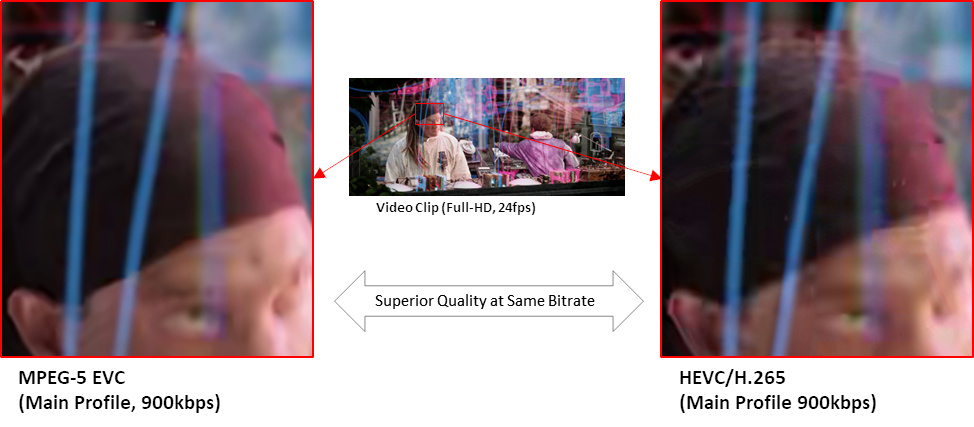

# eXtra-fast Essential Video Encoder (XEVE)
The **eXtra-fast Essential Video Encoder** (XEVE) is an opensource and fast MPEG-5 EVC encoder. 

**MPEG-5 Essential Video Coding** (EVC) is a future video compression standard of ISO/IEC Moving Picture Experts Grop (MPEG). The main goal of the EVC is to provide a significantly improved compression capability over existing video coding standards with timely publication of terms. 
The EVC defines two profiles, including "**Baseline Profile**" and "**Main Profile**". The "Baseline profile" contains only technologies that are older than 20 years or otherwise freely available for use in the standard. In addition, the "Main profile" adds a small number of additional tools, each of which can be either cleanly disabled or switched to the corresponding baseline tool on an individual basis.

## Quality comparison

### MPEG-5 Baseline Profile vs. MPEG-4 AVC/H.264
MPEG-5 EVC Baseline Profile can show 2-times better coding gain over MPEG-4 AVC/H.264 codec and superior quality on the same bitrate


### MPEG-5 Main Profile vs. HEVC/H.265
MPEG-5 EVC Main Profile can show 2-times better coding gain over HEVC/H.265 codec and superior quality on the same bitrate



## How to build

### Linux (64-bit)
- Build Requirements
  - CMake 3.12 or later (download from [https://cmake.org/](https://cmake.org/))
  - GCC 5.4.0 or later
  
- Build Instructions for **Baseline Profile**
  ```
  $mkdir build
  $cd build
  $cmake .. -DSET_PROF=BASE
  $make
  ```
  - Output Location
    - Executable application (xeveb_app) can be found under build/bin/.
    - Library files (libxeveb.so and libxexeb.a) can be found under build/lib/.

- Build Instructions for **Main Profile**
  ```
  $mkdir build
  $cd build
  $cmake ..
  $make
  ```
  - Output Location
    - Executable application (xeve_app) can be found under build/bin/.
    - Library files (libxeve.so and libxexe.a) can be found under build/lib/.
  - Application and libraries built with Main Profile can also support Baseline Profile operation. 


### Windows (64-bit)
- Build Requirements
  - CMake 3.5 or later (download from [https://cmake.org/](https://cmake.org/))
  - MinGW-64 or Microsoft Visual Studio

- Build Instructions for **Baseline Profile**
  - MinGW-64
    ```
    $mkdir build
    $cd build
    $cmake .. -G "MinGW Makefiles" -DSET_PROF=BASE
    $make
    ```
  - Microsoft Visual Studio 
    ```
    $mkdir build
    $cd build
    $cmake .. -G "Visual Studio 15 2017 Win64" -DSET_PROF=BASE
    $make
    ```
    You can change '-G' option with proper version of Visual Studio.

- Build Instructions for **Main Profile**
  - MinGW-64
    ```
    $mkdir build
    $cd build
    $cmake .. -G "MinGW Makefiles"
    $make
    ```
  - Microsoft Visual Studio 
    ```
    $mkdir build
    $cd build
    $cmake .. -G "Visual Studio 15 2017 Win64"
    $make
    ```
    You can change '-G' option with proper version of Visual Studio.
  - Application and libraries built with Main Profile can also support Baseline Profile operation.
    
## How to use
XEVE supports all profiles of EVC. Examples of configure file of coding structures are provided in **cfg** folder.

| OPTION                | DEFAULT   | DESCRIPTION                                                 |
|-----------------------|-----------|-------------------------------------------------------------|
| -i, --input           | -         | file name of input video                                    |
| -o, --output          | -         | file name of output bitstream                               |
| -w, --width           | -         | pixel width of input video                                  |
| -h, --height          | -         | pixel height of input video                                 |
| -z, --hz              | -         | frame rate (Hz)                                             |
| -f, --frames          | -         | maximum number of frames to be encoded                      |
| -q, --op_qp           | 32        | QP value (0~51)                                             |
| -d, --input_bit_depth | 8         | input bitdepth (8, 10)                                      |
| -m, --parallel_task   | 0         | mumber of threads to be created                             |
| -g, --max_b_frames    | 15        | Number of maximum B frames (1,3,7,15)                       |
| -p, --iperiod         | 0 (inf)   | I-picture period. Must be a multiple of (max_b_frames + 1). |
| -r, --recon           | none      | Filename of a raw-video version of the output               |
| -\-profile            | baseline  | index of profile (baseline, main)                           |
| -\-config             | none      | file name of configuration                                  | 
| -\-rc_type            | 0         | 0(rc_off) / 1(CBR, fixed hierarchy bit) / 2 (CBR, equal bit)| 
| -\-bps                | 0.1M      | bits per second (bps, Kbps(K,k), Mbps (M,m))                | 
| -\-vbv_msec           | 2000      | vbv size in msec                                            | 
| -\-preset             | reference | preset of xeve (fast, medium, slow, reference)              | 
| -\-qpa                | 0         | block qp adaptaion 0(off) / 1(on)                           | 

>More options can be found when type **xeve_app** only.   
 
### Example
	$xeve_app -i RaceHorses_416x240_30.yuv -w 416 -h 240 -z 30 --rc_type 0 -o xeve.bin


## License
See [COPYING](COPYING) file for details.
